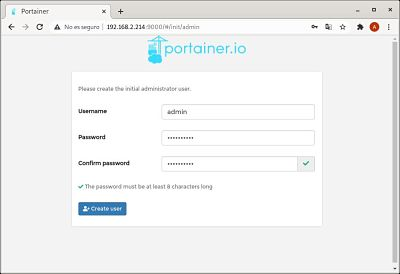
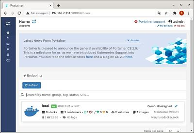

Acceso a Docker-Portainer

- Paso 1:

  
Accedemos con nuestra ip y el puerto 9000 
Una vez accedamos introduccimos el usuario y contraseña que queramos para el portainer.  

- Paso 2:

  
A continuación elegiremos el tipo de instalación, en nuestro caso será local.

- Paso 3:

  
Este es el Dashboard desde el que se podrán ver los contenedores montados, imágenes descargadas, volúmenes configurados.
