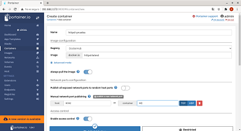
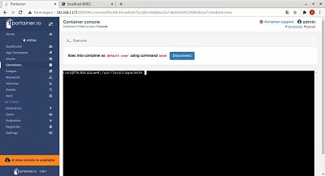

## Despliegue de un contenedor httpd con una paǵina personalizada y mapeaa por el puerto 8082.

- Paso 1  
Creamos el contenedor desde containers,le damos nombre, elegimos la imagen httpd y mapeamos el puerto 8082  

  
- Paso 2  
Comprobamos que se ha lanzado correctamente  

  
- Paso 3   
A continuación vamos a la pestaña consola y nos conectamos  
  
  
Luego añadimos una frase al index.html  

- Paso 4  
Comprobamos que se ha actualizado correctamente  

