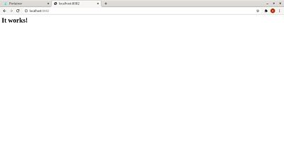

## Despliegue de un contenedor httpd con una paǵina personalizada y mapeaa por el puerto 8082.

- Paso 1  
Creamos el contenedor desde containers,le damos nombre, elegimos la imagen httpd y mapeamos el puerto 8082  

-Paso 2 
Comprobamos que se ha lanzado correctamente  

