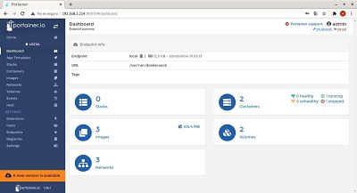
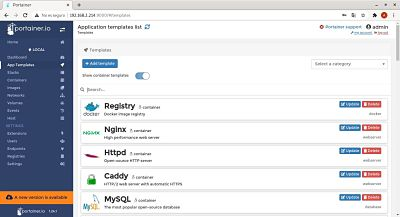

## Descripcion del panel de control

En este apartado explicaremos los elementos que tiene Docker-Portainer  

1.- Dashboard  
En el dashboard tenemos un resumen de los objetos de Docker.Podemos ver cuantos stacks,volumenes e imagenes tenemos.
  
  

2.-App Templates
En App Templates podemos implementar rápidamente contenedores usando imágenes de aquí. Contamos con bases de datos, respaldos CMS, etc.

  
