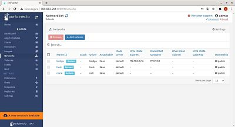
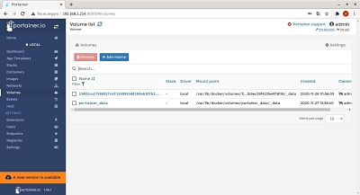

## Descripcion del panel de control

En este apartado explicaremos los elementos que tiene Docker-Portainer  

**1.- Dashboard**  
En el dashboard tenemos un resumen de los objetos de Docker.Podemos ver cuantos stacks,volumenes e imagenes tenemos.
  
  

**2.- App Templates**    
En App Templates podemos implementar rápidamente contenedores usando imágenes de aquí. Contamos con bases de datos, respaldos CMS, etc.

  

**3.- Containers**     
Contiene una lista con todos nuestros contenedores, podemos ver su estado, algunas acciones rápidas que podemos realizar (ver sus registros o leer más sobre ellos)

  

**4.- Images**  
Contiene una lista con todas nuestras imagenes

  

**5.- Networks**  
Contiene una lista con todas las redes

  

**6.- Volumenes**
Contiene una lista con todas nuestros volumenes

  
