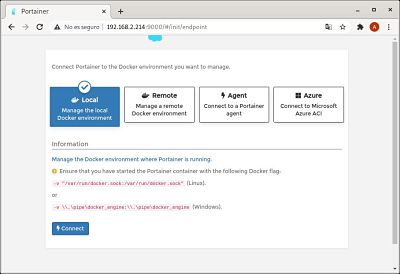
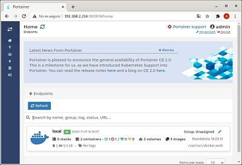

# Instalación
Aqui veremos el proceso de instalacion de Portainer  
- Paso 1: Montamos un contenedor basado en la imagen de **Portainer** 

  
    - docker run -d: crea el contenedor y lo arranca en segundo plano  
    - --name=portainer : es el nombre que le ponemos al contenedor  
    - --hostname=Portainer: El nombre de la máquina.  
    - --network=host: La red host utiliza la dirección IP del servidor.  
    - -restart=always: Reinicia el contenedor si se para.  
    - -v /var/run/docker.sock:/var/run/docker.sock: Vincula una carpeta del servidor (izquierda), con una carpeta del contenedor (derecha). En este caso como Portainer tendrá acceso a los contenedores del servidor  
    - portainer/portainer: Indica la imagen usada para montar el contenedor.
- Paso 2:

  
Accedemos con nuestra ip y el puerto 9000 
Una vez accedamos introduccimos el usuario y contraseña que queramos para el portainer.  

- Paso 3:

A continuación elegiremos el tipo de instalación, en nuestro caso será local.

- Paso 4:

 
